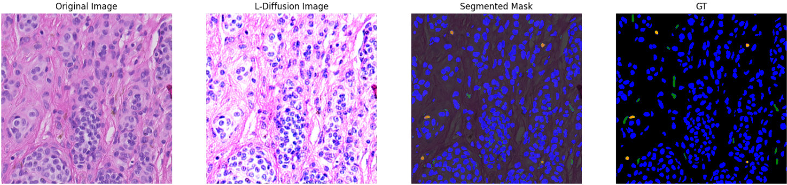
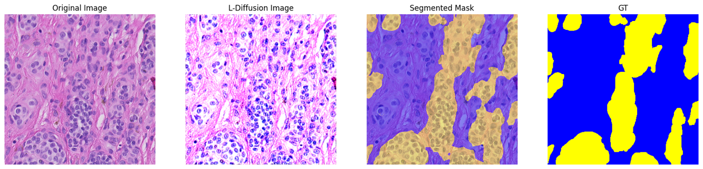

## L-Diffusion:  Laplace Diffusion for Efficient Pathology Image Segmentation

### ✨ Demo of Segmentation Results


### 🛠️ Easy Environment Setup

```shell
conda env create -f environment.yml
```

### 📜 Simple Commands, Efficient Results

#### Download Pre-trained Stable-Diffusion v1.5
You can download the pre-trained Stable-Diffusion v1.5 model from [Hugging Face](https://huggingface.co/stable-diffusion-v1-5/stable-diffusion-v1-5/tree/main)

#### Download PUMA Dataset
You can download the PUMA dataset from [PUMA Dataset](https://drive.google.com/drive/folders/1lzNSJFtSb0IedTC-Y1gKmTHIvCirn9yL?usp=sharing), and the label details can be obtained from [PUMA Label Details](https://puma.grand-challenge.org/dataset/)

#### 🔬 Task [1]: Cell Segmentation

###### Training for Cell Segmentation
 - In `ldiffusion.py`, you can set the `level` parameter to `cell` to train the model for cell segmentation.
 - If your GPU memory is enough, you can set the `component` parameter to `all`. It will train both the segmentor and the L-Diffusion model. The segmentor will be trained first, and then the segmentor will be trained using the L-Diffusion's weight.
 - If your GPU memory is limited, you can first set the `component` parameter to `ldiffusion` to warm up L-Diffusion, and then set the `component` parameter to `segmentor` to train the segmentor model, and set the `ldiffusion_weight` parameter to the path of the L-Diffusion model weight.

---

###### GPU Enough
```python
if __name__ == "__main__":
    args = parse_args()
    print("\033[35m" + str(vars(args)) + "\033[0m")
    trainer = LDiffusionModel(args.diffusion_path, level="cell")
    trainer.train(args, component="all", ldiffusion_weight=None)
````
###### GPU Limited

- First, use the following code to warm up L-Diffusion:
```python
if __name__ == "__main__":
    args = parse_args()
    print("\033[35m" + str(vars(args)) + "\033[0m")
    trainer = LDiffusionModel(args.diffusion_path, level="cell")
    trainer.train(args, component="ldiffusion", ldiffusion_weight=None)
````
- Then, use the following code to train the segmentor model:
```python
if __name__ == "__main__":
    args = parse_args()
    print("\033[35m" + str(vars(args)) + "\033[0m")
    trainer = LDiffusionModel(args.diffusion_path, level="cell")
    trainer.train(args, component="segmentor", ldiffusion_weight='your ldiffusion weight path')
````

---

Current terminal location is here:
```shell
$ pwd
~/project

project/
├── LDiffusion/
```
Run the following command to train the model:
```shell
python -m LDiffusion.ldiffusion --diffusion-path [stable_diffusion_v1.5] --image-dir .../PUMA/01_training_dataset_tif_ROIs --label-dir .../PUMA/01_training_dataset_png_ROIs_nuclei --num-epochs 100 --batch-size 1 --num-inference-steps 5 --num-classes 11
```

###### Inference for Cell Segmentation

```python
import matplotlib.pyplot as plt
from PIL import Image
from LDiffusion.ldiffusion import LDiffusionModel

ldiffusion_model = LDiffusionModel(
    diffusion_path="../stable_diffusion_v1.5",
    level="cell"
)

ldiffusion_image, mask = ldiffusion_model.inference(
    image_path="../PUMA/01_training_dataset_tif_ROIs/training_set_primary_roi_002.tif",
    ldiffusion_weight='../LDiffusion/train_save/unet/XX_XX_XX',
    segmentor_weight='../LDiffusion/train_save/cellclassifier/XX_XX_XX',
    num_classes=11
)

image = Image.open("../PUMA/01_training_dataset_tif_ROIs/training_set_primary_roi_002.tif").convert('RGB')

gt = convert_labels("../PUMA/01_training_dataset_png_ROIs_tissue/training_set_primary_roi_002.png")

...
```



*** 

#### 🔬 Task [2]: Tissue Segmentation

###### Training for Tissue Segmentation
 - In `ldiffusion.py`, you can set the `level` parameter to `tissue` to train the model for tissue segmentation.
 - If your GPU memory is enough, you can set the `component` parameter to `all`. It will train both the segmentor and the L-Diffusion model. The segmentor will be trained first, and then the segmentor will be trained using the L-Diffusion's weight.
 - If your GPU memory is limited, you can first set the `component` parameter to `ldiffusion` to warm up L-Diffusion, and then set the `component` parameter to `segmentor` to train the segmentor model, and set the `ldiffusion_weight` parameter to the path of the L-Diffusion model weight.

```python
if __name__ == "__main__":
    args = parse_args()
    print("\033[35m" + str(vars(args)) + "\033[0m")
    trainer = LDiffusionModel(args.diffusion_path, level="tissue")
    trainer.train(args, component="all", ldiffusion_weight='your ldiffusion weight path')
```

Run the following command to train the model:

```shell
python -m LDiffusion.ldiffusion --diffusion-path [stable_diffusion_v1.5] --image-dir .../PUMA/01_training_dataset_tif_ROIs --label-dir .../PUMA/01_training_dataset_png_ROIs_tissue --num-epochs 100 --batch-size 2 --num-inference-steps 5 --num-classes 7
```

###### Inference for Tissue Segmentation
```python
import matplotlib.pyplot as plt
from PIL import Image
from LDiffusion.ldiffusion import LDiffusionModel

ldiffusion_model = LDiffusionModel(
    diffusion_path="../stable_diffusion_v1.5",
    level="tissue"
)

ldiffusion_image, mask = ldiffusion_model.inference(
    image_path="../PUMA/01_training_dataset_tif_ROIs/training_set_primary_roi_002.tif",
    ldiffusion_weight='../LDiffusion/train_save/unet/XX_XX_XX',
    segmentor_weight='../LDiffusion/train_save/deeplabv3/XX_XX_XX',
    num_classes=7
)

image = Image.open("../PUMA/01_training_dataset_tif_ROIs/training_set_primary_roi_002.tif").convert('RGB')

gt = convert_labels("../PUMA/01_training_dataset_png_ROIs_tissue/training_set_primary_roi_002.png")

...
```


